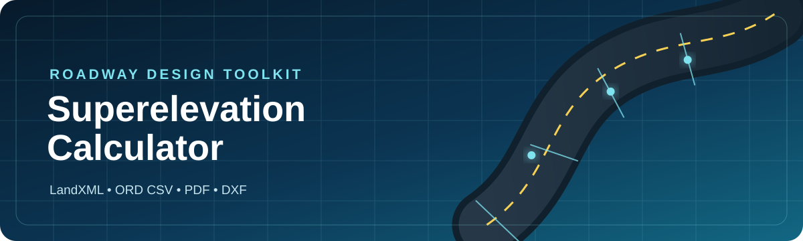
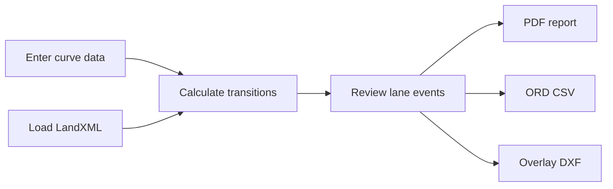

<p align="center">
  
</p>

<p align="center">
  <strong>Roadway superelevation calculations, design review, and CAD-ready exports in one Windows desktop app.</strong>
</p>

<p align="center">
  <a href="https://github.com/colewinstead/Super_Elevation_Calculator/releases/latest"></a>
  <a href="https://github.com/colewinstead/Super_Elevation_Calculator/actions/workflows/tests.yml"></a>
  
  
</p>

<p align="center">
  <a href="https://github.com/colewinstead/Super_Elevation_Calculator/releases/latest"><strong>Download for Windows</strong></a>
  &nbsp;&middot;&nbsp;
  <a href="#quick-start">Run from source</a>
  &nbsp;&middot;&nbsp;
  <a href="#engineering-notes">Engineering notes</a>
</p>

---

## What it does

Superelevation Calculator turns roadway curve inputs and LandXML alignments into review-ready calculations and deliverables. It is designed around practical OpenRoads Designer and MicroStation handoff workflows.

| Calculate | Review | Export |
|:--|:--|:--|
| MDOT-style curve calculations | Lane-by-lane slopes and stations | PDF calculation reports |
| Normal crown and full super cases | Project, route, alignment, and curve metadata | ORD-compatible CSV |
| Station equations | LandXML geometry validation | Real-coordinate overlay DXF |
| East/West coordinate transforms | Actionable export warnings | Reusable project JSON |

## Typical workflow



1. Enter curve information manually or load an alignment from LandXML.
2. Review calculated transition stations and signed lane slopes.
3. Save the project for later editing.
4. Export a PDF report, ORD CSV, or CAD overlay DXF.
5. Verify the result in OpenRoads Designer or MicroStation before production use.

## Download

Download the latest Windows executable from [GitHub Releases](https://github.com/colewinstead/Super_Elevation_Calculator/releases/latest). The executable is distributed as a release asset instead of being stored in the source tree.

> [!IMPORTANT]
> This is an engineering aid. Always validate criteria, stationing, coordinate systems, lane naming, and exported geometry against the governing standards and the project design file.

## Quick start

Requires Python 3.11 or newer.

```powershell
git clone https://github.com/colewinstead/Super_Elevation_Calculator.git
Set-Location .\Super_Elevation_Calculator
python -m pip install -r .\requirements.txt
python .\super_app.py
```

## Export formats

### PDF report

Produces a formatted calculation report using the same curve objects shown in the desktop interface.

### ORD CSV

Writes Bentley's documented superelevation import columns:

```text
SuperelevationLane,Station,CrossSlope,PivotAbout,PointType,TransitionType,NonLinearCurveLength
```

Station labels account for LandXML station equations and advance through ORD regions such as `R2`, `R3`, and `R4`.

### Overlay DXF

Creates a graphics overlay in real project coordinates from LandXML line and circular-arc geometry. It includes:

- lane-specific leaders and signed slope labels
- PC and PT station callouts
- curve names, direction, and radius
- collision-aware label placement
- MDOT-oriented levels, colors, weights, and text styling
- US survey foot declarations and optional East/West zone transformation

The DXF is a graphics handoff, not a native Bentley civil model.

## LandXML support

| Supported | Detected with warning |
|:--|:--|
| Alignment name and start station | Spiral geometry |
| Linear units | Unsupported or incomplete geometry |
| Line geometry | Ambiguous displayed stations |
| Circular arcs | Out-of-range export stations |
| Station equations | Missing coordinate context |

## Engineering notes

<details>
<summary><strong>ORD import checklist</strong></summary>

Before production use, verify that:

- the target superelevation section and lanes already exist
- lane names match between the application and ORD
- station formatting matches the design file
- station equations resolve to the intended alignment region
- transition type, pivot settings, and nonlinear lengths match project criteria

</details>

<details>
<summary><strong>Lane slope sign convention</strong></summary>

- Normal crown: both lanes negative
- Right-hand curve: left lane positive, right lane negative through full super
- Left-hand curve: left lane negative, right lane positive through full super
- Positive display values always include an explicit `+`

</details>

<details>
<summary><strong>DXF and MicroStation checks</strong></summary>

Always verify reference units, working units, origin, coincident placement, rotation, stationing assumptions, text scale, and readability in ORD or MicroStation.

LandXML points are interpreted as Northing/Easting and written to CAD as X=Easting and Y=Northing. Coordinate transformation requires the correct MDOT MS83/2011 East or West zone selection.

</details>

## Project structure

| File | Purpose |
|:--|:--|
| [`super_app.py`](super_app.py) | Desktop application entry point |
| [`Super.py`](Super.py) | Core superelevation calculation path |
| [`super_landxml.py`](super_landxml.py) | LandXML parsing and station geometry |
| [`super_exports.py`](super_exports.py) | Shared lane-event and export logic |
| [`super_dxf.py`](super_dxf.py) | Overlay DXF generation |
| [`super_pdf.py`](super_pdf.py) | PDF calculation reports |
| [`super_project.py`](super_project.py) | Project save/load support |

## Tests

```powershell
python -m pip install -r .\requirements.txt
python -m unittest -v
```

The test suite covers calculation sharing, station formatting, lane signs, LandXML parsing, coordinate transforms, project persistence, ORD CSV mapping, and DXF generation.

## Contributing

Bug reports and focused pull requests are welcome. When reporting an export problem, include the expected stationing/sign behavior and a minimal, non-sensitive reproduction case.

## License

No open-source license has been selected yet. The source is publicly visible, but reuse and redistribution rights are not granted unless a license is added.
